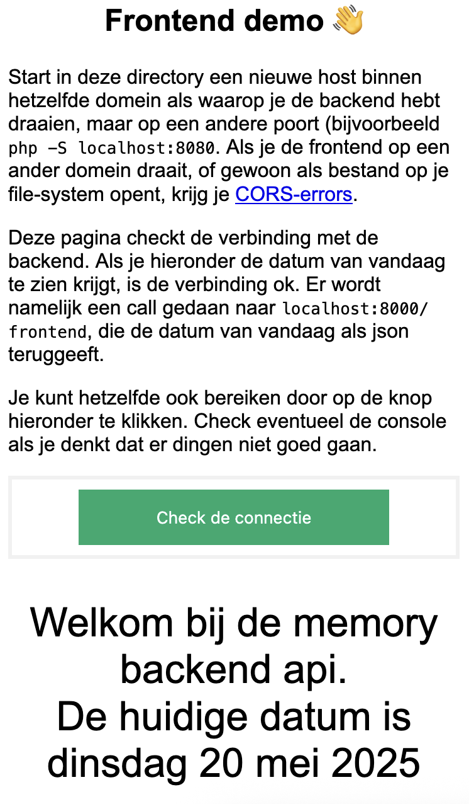

# Memory Backend

Een php/symfony applicatie om te gebruiken voor het opslaan van spelers en spellen van het javascript memory spel. Het is de bedoeling dat je *alleen* aan de frontend werkt. We hebben die backend juist gemaakt om de situatie te simuleren waarin je als developer geen mogelijkheid hebt om een deel van de applicatie (deze backend in dit geval) zelf aan te passen. Dat gezegd hebbende is het best mogelijk dat je dingen in de backend tegenkomt die echt beter moeten. We hebben dat ding redelijk snel in elkaar gezet, dus we doen geen enkele garantie over hoe goed het is. Het staat je dus zeker vrij om dit aan te passen en een pull-request te doen.

We maken bij deze applicatie gebruik van [de LexikJWTAuthenticationBundle](https://github.com/lexik/LexikJWTAuthenticationBundle). Bekijk eventueel de code om te onderzoeken hoe dat ding werkt.

# Installatie en opstarten

Clone deze repository ergens op je lokale machine (dus NIET in de cloud). De afhankelijkheden in van het project staan, zoals te doen gebruikelijk, in het bestand `package.json`. Installeer deze afhankelijkheden met behulp van [composer](https://getcomposer.org/):

```shell
# installatie van de dependencies
php composer.phar install #of composer install
```

## Opzetten van de jwt

De applicatie maakt gebruik van een [sqlite3 database](https://sqlite.org/index.html), [lexik/jwt](https://symfony.com/bundles/LexikJWTAuthenticationBundle/current/index.html) en [doctrine](https://www.doctrine-project.org/). Voor het werken met JWT is het noodzakelijk dat je een goed *passphrase* bedenk, waarmee de tokens gekruid (*gesalt*) kunnen worden. Check het bestand `.env` en pas eventueel de gegevens volgens de onderstaande gegevens aan (in de code hieronder gebruiken we 'BeeFrogFlower' als passphrase):

```shell
DATABASE_URL="sqlite:///%kernel.project_dir%/var/data.db"
###> nelmio/cors-bundle ###
CORS_ALLOW_ORIGIN='^https?://(localhost|127\.0\.0\.1)(:[0-9]+)?$'
###< nelmio/cors-bundle ###

###> lexik/jwt-authentication-bundle ###
JWT_SECRET_KEY=%kernel.project_dir%/config/jwt/private.pem
JWT_PUBLIC_KEY=%kernel.project_dir%/config/jwt/public.pem
JWT_PASSPHRASE=BeeFrogFlower
###< lexik/jwt-authentication-bundle ### 
```
Maak nu de private en publieke sleutel aan die bij de jwt gebruikt worden. Gebruik hiervoor de onderstaande code. Je zult gevraagd worden om een passphrase aan te geven; dat moet natuurlijk hetzelfde zijn als wat je hierboven in `.env` hebt ingevuld.

```shell
mkdir config/jwt/
openssl genrsa -out config/jwt/private.pem -aes256 4096
openssl rsa -pubout -in config/jwt/private.pem -out config/jwt/public.pem
```

## opzetten van de database

Voor de database maken we gebruik van doctrine; de entity-klassen vind je in `src/Entity/` (je verwacht het niet). Maak aan de hand hiervan de database aan:

```shell
php bin/console doctrine:schema:update --force --complete
``` 

Dit maakt de datbaase aan in `var/data.db` aan. Bekijk eventueel de gegenereerde database met behulp van sqlite3.

## runnen van de app

Je kunt de app opstarten met behulp van de ingebouwde php server:

```shell
php -S localhost:8000 -t public
```

## PDO foutmelding

Mocht je de foutmelding krijgen dat er een PDO-dependecy niet gevonden kan worden, dan moet je de `php.ini` aanpassen, zodat de extensies `pdo_sqlite`, `sodium`, `sqlite3` en `openssl` gevonden kunnen worden.
Daarnaast is het op Windows van belang dat `extension_dir = "ext"` ook aangepast wordt (Door de `;` er voor weg te halen).

## Deprecation warnings

Wanneer je deprecation warnings krijgt is het van belang om je `php.ini` goed in te stellen (op regels 485 en 502, respectievelijk):

```php
error_reporting = E_ALL & ~E_DEPRECATED
display_errors = Off 
```

Daarna moet je symfony vertellen dat je de boel in productie hebt draaien, en niet in ontwikkeling. Zet daarvoor het onderstaande in je `.env` (vervang eventueel de waarden die er al staan):

```php
APP_ENV=prod
APP_DEBUG=0
```

Bekijk eventueel ook [deze discussie op StackOverflow](https://stackoverflow.com/a/48869783/10974490).

## Backend draaien met docker
Het is ook mogelijk om de backend the hosten in een docker-container. Om dat te starten moet het volgende commando worden uitgevoerd. Als je dit doet is het nodig om de dependencies te installeren en de database op te zetten. Je moet wel de JWT sleutels eerst aanmaken.
```shell
# Bouwen en taggen image
docker compose -f 'compose.yaml' up -d --build
```
Als dit commando voltooid is, is er een container gestart die naar de poort 8000 van de localhost luistert. Verder is de folder /var gemount in deze container zodat de database ook lokaal beschikbaar is.

# Het vullen van de database

Het database-schema is vrij eenvoudig van opzet: er is een tabel `player` en een tabel `game` (die op een wat ingewikkelde manier met elkaar verbonden zijn: zie [deze blog om te lezen waarom](https://www.doctrine-project.org/projects/doctrine-orm/en/latest/reference/association-mapping.html#one-to-many-unidirectional-with-join-table)). Check de entiteiten in `App/Entity/` om een beeld te krijgen van hoe deze twee zich tot elkaar verhouden.

Ga in de directory `create`. Hier vind je een aantal scripts (eigenlijk gewoon `cURL` calls) die je kunnen helpen met het opzetten en testen van de applicatie. Als je de server hebt draaien kun je deze scripts op de hieronder gegeven volgorde draaien om spelers en spellen aan te maken. Hierbij wordt er van uitgegaan dat de applicatie draait op `localhost:8000`. Als je het ergens anders draait, moet je vanzelfsprekend de nodige gegevens aanpassen.

bestandsnaam | omschrijving
----|----
`create_users.sh`  | Om een aantal spelers in de database aan te maken
`create_games.sh`  | Om een aantal spellen in de database op te slaan

Hierna kun je checken of het inloggen werkt, door gebruik te maken van het script `login_player.sh` of `login_admin.sh`. Als je een speler of een admin inlogt, krijg je van de applicatie een JWT terug. Sla deze op in respectievelijk `player_token` en `admin_token`. Deze bestanden moeten de onderstaande inhoud hebben:

```shell
Authorisation: Bearer <jwt-token-dat-je-terugkreeg> 
```

Nu kun je de onderstaande scripts runnen om te kijken of alles werkt. Bestudeer ook de scripts zelf om inzicht te krijgen in de API's. In de code is hard geprogrammeerd dat de gebruiker met gebruikersnaam 'Henk' de `ROLE_ADMIN` heeft.

bestandsnaam | omschrijving
----|----
`login_player.sh`  | Om een speler in te loggen; sla het teruggegeven jwt op in het bestand `player_token`
`check_player.sh`  | Om het jwt van een ROLE_USER te checken
`change_prefs.sh`  | Om de voorkeuren van een speler aan te passen
`change_email.sh` | Om het emailadres van een speler aan te passen
`login_admin.sh`  | Om een administrator in de loggen; sla het teruggegeven jwt op in het bestand `admin_token`
`check_admin.sh`   | Om het jwt van een ROLE_ADMIN te checken
`failed_login_user.sh`  | Om een speler met verkeerde credentials te checken

## Connectie maken vanaf een frontend

In deze repository vind je ook een directory `frontend`, met daarin één pagina: `index.html`. Deze pagina kun je gebruiken om je setup te checken. Start in deze directory een locale server op die naar een *andere poort* dan de backend zelf luistert (bijvoorbeeld poort 8080).

```shell
# in de directory frontend
php -S localhost:8080
```

Om vanaf een frontend connectie te maken met deze backend is het noodzakelijk om de frontend in hetzelfde domein te hebben draaien als de backend; als je de frontend op een ander domein draait, of gewoon als bestand op je file-system opent, krijg je [CORS-errors](https://developer.mozilla.org/en-US/docs/Web/HTTP/CORS/Errors).


Ga vervolgens met een browser naar `localhost:8080/`. Als het goed is zie je nu een test-pagina. Klik op de knop om de connectie te testen. Hiermee wordt een call gedaan naar `localhost:8000/frontend` die de huidige datum teruggeeft. De test-pagina toont vervolgens deze datum onder het formulier:




# End-points

De applicatie heeft de volgende end-points. Ze spreken redelijk voor zich, maar bestudeer eventueel de Controllers en [de gegenereerde documentatie](http://localhost:8000/api/docs).

### ANONYMOUS

Methode en end-point | return value | omschrijving
----|----|----
`GET memory/scores` |  200 Ok | Overzicht van de spelers en hun *gemiddelde* score (ongesorteerd)
`GET memory/top-scores` | 200 Ok | Lijst van alle spelers met hun beste score (gesorteerd op score, lager is beter)
`POST memory/register` | 201 Created | Registeren van een speler
" | 400 Illegal Request | Als de opgestuurde gegevens niet kloppen met het model
`POST /memory/login` | 200 Ok | Als de credentials kloppen met de speler, komt hier een JWT terug
" | 401 Unauthorized | Als de credentials niet kloppen (specifiek password niet bij username)
`POST /game/save` | 201 Created | Opslaan van game voor speler
" | 400 | Als request niet overeenkomt met het model

### ROLE_USER

De `id` van de speler zit in de het JWT (de `sub`-claim). Dat `id` wordt server side uit het JWT gehaald.

Methode en end-point | return value | omschrijving
----|----|----
`GET /player/` | 200 Ok | Alle gegevens van speler `id`
" | 404 Not Found | Als de `id` niet gevonden is
`GET /player/games` | 200 Ok | De spellen die de speler met `id` heeft gespeeld
" | 404 Not Found | Als de `id` niet gevonden is
`GET /player/preferences` | 200 Ok | De voorkeuren van speler `id` (api en kleuren voor gesloten en gevonden kaarten)
" | 404 Not Found | Als de `id` niet gevonden is
`POST /player/preferences` | 204 No Content | Aanpassen van de voorkeuren van speler `id` (api en kleuren voor gesloten en gevonden kaarten)
" | 404 Not Found | Als de `id` niet gevonden is
`GET /player/email` | 200 Ok | Het email-adres van speler `id`
" | 404 Not Found | Als de `id` niet gevonden is
`PUT /player/email` | 204 No Content | Aanpassen van het email=adres van speler `id`
" | 404 Not Found | Als de `id` niet gevonden is

### ROLE_ADMIN

Methode en end-point | return value | omschrijving
----|----|----
`GET /admin/aggregate` | 200 Ok | Totaal aantal gespeelde spellen en spelers; overzicht van de gekozen api's
`GET /admin/players` | 200 Ok | Overzicht van gebruikersnamen en email-adressen van alle spelers
`GET /admin/dates` | 200 Ok | Totaal van het aantal gespeelde spelletjes per dag

## Logging

De applicatie maakt gebruik van [monolog](https://github.com/Seldaek/monolog) voor het bijhouden van log-bestanden. De logs worden bijgehouden in `var/log/`. In totaal zijn vier verschillende logs gedefinieerd:

naam | omschrijving
----|----
`dev` | hierin komen alle meldingen (met niveau `INFO` of hoger) te staan
`request` | de requests met de gevonden route (zo die er is)
`monolog` | alle gebeurtenissen op de database (vanaf level `INFO`)
`error` | alle foutmelden die door de applicatie worden gegenereerd

Om de leesbaarheid van de logs wat te vergroten wordt de volledige melding wat gekort. Het standaard-formaat is `datetime \t request \t message`. Dit gebeurt in de klasse `src\Util\CustomFormatter`. Bestudeer de code in deze klassen wanneer je het formaat toch nog anders wilt hebben. De logs zelf zijn gedefinieerd in `config/packages/monolog.yaml`.
